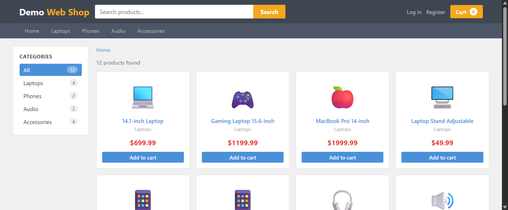
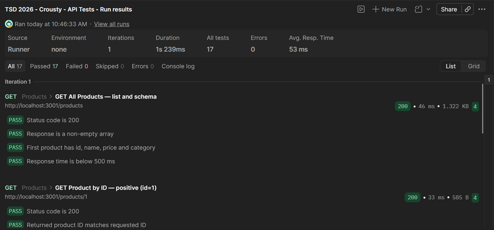

# Final Report — Software Testing Project TSD 2026

**Team:** Crousty  
**Course:** TSD — Testing Software & Debugging 2026  
**Application:** Demo Web Shop (`https://tsd-2026-crousty.onrender.com`)  
**Submission:** 2026-07-09  

---

## 1. Introduction

This report documents the end-to-end testing work carried out over the TSD 2026 semester on
the **Demo Web Shop** application. The project covered the full spectrum of testing activities:
manual test design, unit testing with JUnit, UI automation with Selenium WebDriver, keyword-driven
testing with Robot Framework, and REST API testing with Postman. The goal was to develop practical
skills in each discipline and produce reproducible, documented evidence of software quality.

---

## 2. Team and Roles

| Member | Role | Responsibilities |
|---|---|---|
| Flavien | Lead tester / developer | Test design, automation, documentation, defect reporting |

The project was completed as a solo submission. All activities — from selecting the application
to writing automated tests and producing this report — were performed by a single team member.

---

## 3. Tested Application

**Name:** Demo Web Shop  
**URL:** `https://tsd-2026-crousty.onrender.com` (live) · `http://localhost:3001` (local: `cd demo-shop && npm start`)  
**Technology stack:** Node.js, json-server 0.17.4, vanilla JavaScript (SPA with hash routing)

The Demo Web Shop is a single-page e-commerce application that simulates a realistic online
shopping experience. Users can browse products, search by keyword, add items to a cart, and
simulate a checkout flow. Data is persisted in a local `db.json` file served by json-server.
The application uses hash-based routing (`/#/login`, `/#/search`, `/#/cart`, etc.).

**Why this application?** It provides a stable, offline-capable SPA with enough interactive
elements (forms, async fetch calls, dynamic DOM updates) to meaningfully exercise UI automation
frameworks and API testing tools, without requiring external network access or cloud credentials.

---

## 4. Test Scope

### In scope

| Feature | Description |
|---|---|
| User Authentication | Login (valid/invalid credentials), logout |
| Product Search | Keyword search, results display |
| Shopping Cart | Add to cart, cart count update, success notification |
| Boundary validation | Quantity limits, password length |
| Checkout process | Guest and registered user flows |

### Out of scope

- Payment gateway (no real card processing)
- Admin dashboard and inventory management
- Performance and load testing
- Security / penetration testing
- Mobile / responsive layout

---

## 5. Test Plan

Full test plan: [`docs/test-plan.md`](../docs/test-plan.md)

### Summary

| Dimension | Decision |
|---|---|
| **Approach** | Black-box functional testing + boundary/equivalence testing |
| **Environment** | Windows 11, Chrome (latest), Node.js 18+, Java 17+ |
| **Automation criteria** | Stable UI flow, clear assertion, high regression value |
| **Risk: async DOM** | Mitigation: explicit waits (WebDriverWait / Wait Until Element Is Visible) |
| **Risk: test data** | Mitigation: localStorage.clear() before each Selenium test; fresh browser per Robot test |

---

## 6. Manual Test Cases

Full table: [`manual-tests/manual-test-cases.md`](../manual-tests/manual-test-cases.md)

| TC ID | Title | Feature | Priority | Type | Automated |
|---|---|---|---|---|---|
| TC-001 | Successful login | Authentication | High | Positive | Selenium + Robot |
| TC-002 | Search existing product | Search | High | Positive | Selenium |
| TC-003 | Add item to cart | Shopping Cart | High | Positive | Selenium |
| TC-004 | Login with wrong password | Authentication | Medium | Negative | Robot |
| TC-005 | Search non-existing product | Search | Low | Negative | Manual |
| TC-006 | Checkout with empty cart | Checkout | Medium | Negative | Manual |
| TC-007 | Password minimum length | Authentication | Medium | Boundary | Manual |
| TC-008 | Add zero or negative quantity | Shopping Cart | Medium | Boundary | Manual |
| TC-009 | Full checkout flow (Guest) | Checkout | High | Flow | Manual |
| TC-010 | Full checkout flow (Registered) | Checkout | High | Flow | Manual |

**Manual execution results:**

| TC ID | Status | Notes |
|---|---|---|
| TC-001 | PASS | Email shown in header after login |
| TC-002 | PASS | Laptop products displayed in results |
| TC-003 | PASS | Success toast + cart badge increment |
| TC-004 | PASS | Error banner displayed |
| TC-005 | PASS | "No products were found" message shown |
| TC-006 | PASS | Checkout button disabled for empty cart |
| TC-007 | PASS | Password length validated correctly by the application |
| TC-008 | FAIL | App accepts qty 0 and shows success — defect logged (BUG-001) |
| TC-009 | PASS | Order confirmation shown |
| TC-010 | PASS | Order confirmation shown with saved address |

---

## 7. Defect Report

Full report: [`reports/defect-report-example.md`](../reports/defect-report-example.md)

**BUG-001 — System accepts quantity 0 without validation error**

| Field | Value |
|---|---|
| **Severity** | Medium |
| **Priority** | Medium |
| **Component** | Shopping Cart |
| **TC reference** | TC-008 |
| **Steps** | Open product page → enter qty `0` → click Add to cart |
| **Expected** | Validation error: "Quantity must be greater than 0" |
| **Actual** | Green success toast shown, but cart counter stays at 0 — misleading UX |
| **Status** | Open (not fixed in Demo Web Shop scope) |

---

## 8. JUnit Unit Testing

Full report: [`reports/lab2-unit-testing.md`](../reports/lab2-unit-testing.md)

### Exercise: `Rating` class

A `Rating` utility class was implemented and tested using JUnit 5 to exercise unit testing
concepts: equivalence partitioning, boundary value analysis, and the JUnit lifecycle.

| Test | Input | Expected | Result |
|---|---|---|---|
| `testValidRating_1` | rating = 1 | accepted | PASS |
| `testValidRating_3` | rating = 3 | accepted | PASS |
| `testValidRating_5` | rating = 5 | accepted | PASS |
| `testBoundary_0` | rating = 0 | `IllegalArgumentException` | PASS |
| `testBoundary_6` | rating = 6 | `IllegalArgumentException` | PASS |
| `testNegative` | rating = -1 | `IllegalArgumentException` | PASS |

All 6 unit tests passed. The exercise demonstrated `@Test`, `@BeforeEach`, `@AfterEach`,
`assertThrows`, and `assertEquals` from JUnit Jupiter.

---

## 9. Selenium UI Automation

Full report: [`reports/lab4-selenium-report.md`](../reports/lab4-selenium-report.md)  
Evidence: [`reports/lab4-selenium-evidence.png`](../reports/lab4-selenium-evidence.png)

### Tool: Selenium WebDriver 4.18.1 + JUnit 5 (Java)

Test file: [`automation/selenium/src/test/java/DemoWebShopTest.java`](../automation/selenium/src/test/java/DemoWebShopTest.java)

| Test | TC ID | Description | Result |
|---|---|---|---|
| `TC001_shouldLoginWithValidCredentials` | TC-001 | Valid login → email in header | PASS |
| `TC002_shouldDisplayResultsWhenSearchingForLaptop` | TC-002 | Search "Laptop" → products displayed | PASS |
| `TC003_shouldAddProductToCartAndShowNotification` | TC-003 | Add to cart → toast + badge increment | PASS |

**Execution:** `cd automation\selenium && mvnw.cmd test`  
**Result:** `Tests run: 3, Failures: 0, Errors: 0, Skipped: 0 — BUILD SUCCESS` (2026-07-06, 15.63s)

### Key technical decisions

- **Selenium Manager** (built-in since v4) eliminates manual ChromeDriver setup
- **`WebDriverWait` + `ExpectedConditions`** for all async DOM interactions — no `Thread.sleep()`
- **`localStorage.clear()` via JavascriptExecutor** in `@BeforeEach` for test isolation
- **Headless mode** auto-activated on Linux/WSL (CI-compatible)

---

## 10. Robot Framework Tests

Full report: [`reports/lab5-robot-framework-report.md`](../reports/lab5-robot-framework-report.md)

### Tool: Robot Framework 7.1.1 + SeleniumLibrary 6.7.1 (Python)

Test file: [`automation/robot/tests/demo_shop_tests.robot`](../automation/robot/tests/demo_shop_tests.robot)  
Keywords: [`automation/robot/resources/common_keywords.robot`](../automation/robot/resources/common_keywords.robot)

| Test | TC ID | Type | Result |
|---|---|---|---|
| TC-001 Valid Login Shows User Email In Header | TC-001 | Positive | PASS |
| TC-004 Invalid Login Shows Error Message | TC-004 | Negative | PASS |

**Execution:** `cd automation\robot && robot --outputdir results tests/demo_shop_tests.robot`

### Custom keywords

`Open Demo Web Shop`, `Navigate To Login Page`, `Fill Login Form`,
`Verify User Is Logged In`, `Verify Login Error Message`, `Close Demo Web Shop`

---

## 11. Postman API Tests

Full report: [`reports/lab6-postman-report.md`](../reports/lab6-postman-report.md)  
Collection: [`automation/postman/crousty-api-tests.postman_collection.json`](../automation/postman/crousty-api-tests.postman_collection.json)  
Evidence: [`reports/lab6-postman-evidence.png`](../reports/lab6-postman-evidence.png)

### Tool: Postman (Collection v2.1)

**Collection name:** TSD 2026 - Crousty - API Tests  
**Base URL variable:** `{{BASE_URL}}` = `https://tsd-2026-crousty.onrender.com`

| # | Request | Method | Scenario | Status | Assertions |
|---|---|---|---|---|---|
| 1 | `/products` | GET | Positive — list all products | 200 | 4 |
| 2 | `/products/1` | GET | Positive — get by ID, schema check | 200 | 4 |
| 3 | `/products?name_like=Laptop` | GET | Positive — keyword search | 200 | 3 |
| 4 | `/products/9999` | GET | Negative — non-existing ID | 404 | 2 |
| 5 | `/cart` | POST | Positive — create cart item | 201 | 4 |

**Total: 5 requests · 17 assertions · 5 PASS · 0 FAIL**

### Key assertions (pm.test)

- **GET /products:** status 200, array non-empty, schema fields (`id`, `name`, `price`, `category`), response time < 500 ms
- **GET /products/1:** status 200, `id === 1`, all schema fields present, `price > 0`
- **GET ?name_like=Laptop:** status 200, results non-empty, every result name contains "laptop"
- **GET /products/9999:** status 404, response body is `{}`
- **POST /cart:** status 201, auto-generated `id` present, `productId` and `quantity` match request body

### Collection variable

The `BASE_URL` collection variable centralises the target environment. Switching from
local development to a staging server requires only this one value to change.

---

## 12. Results Summary

| Lab | Tool | Tests | Passed | Failed |
|---|---|---|---|---|
| Lab 3 (manual) | Manual | 10 | 9 | 1 (BUG-001) |
| Lab 4 | Selenium WebDriver | 3 | 3 | 0 |
| Lab 5 | Robot Framework | 2 | 2 | 0 |
| Lab 6 | Postman | 5 | 5 | 0 |

> **Note:** Lab 2 (JUnit — `Rating` class) is a standalone unit testing exercise unrelated to the Demo Web Shop and is therefore not included in this project results table. It is documented separately in section 8.

**Overall automated coverage:** 10 tests automated across 3 tools — 3 Selenium (TC-001, TC-002, TC-003),
2 Robot Framework (TC-001, TC-004), and 5 Postman API requests. TC-005 through TC-010 remain manual.

---

## 13. Limitations

- **No payment integration:** The checkout flow ends at order confirmation; no real payment
  gateway was available to test card processing, decline handling, or refunds.
- **Single user account:** All login tests use `demo@webshop.com`. Concurrent session and
  account creation flows were not fully covered.
- **json-server state mutation:** Selenium tests that add to cart modify `db.json`.
  The file must be restored (`git restore demo-shop/db.json`) before each clean test run.
- **No CI/CD pipeline:** Tests were run manually. A GitHub Actions workflow integrating
  Maven and Robot Framework would make results reproducible on every commit.
- **Robot Framework evidence:** HTML report must be generated locally and screenshotted —
  the generated files are not committed (too large, gitignored).
- **Postman coverage incomplete** until Lab 6 is submitted.

---

## 14. Lessons Learned

1. **Explicit waits are non-negotiable for SPAs.** Hash-routing apps load content
   asynchronously via fetch; any implicit wait or fixed sleep causes flaky tests.
   Both `WebDriverWait` (Selenium) and `Wait Until Element Is Visible` (Robot) solved this.

2. **Test isolation requires intentional setup.** Without `localStorage.clear()`, cart state
   leaked from TC-003 into TC-001 when run in the same browser session, causing false failures.

3. **Robot Framework lowers the barrier for readable tests.** Keyword-driven syntax meant
   the same test logic readable by both developer and non-developer stakeholders, with no Java
   boilerplate.

4. **Maven Wrapper (`mvnw.cmd`) is essential for team portability.** Without it, every team
   member who lacks a local Maven installation is blocked. The wrapper downloads Maven once and
   caches it — zero configuration for new environments.

5. **Cross-OS node_modules are incompatible.** Installing `node_modules` on Windows and then
   running `npm start` from WSL causes native binary mismatches. The lesson: always install
   dependencies from within the target OS.

6. **A defect in the happy path is still a defect.** BUG-001 (qty 0 accepted silently)
   appears to succeed — the green toast fires — but the cart count does not change. Silent
   misbehavior is harder to detect than a crash and more confusing for end users.

---

## 15. Conclusion

This project provided hands-on experience with the full testing lifecycle: from requirements
analysis and manual test case design, through unit testing and UI automation, to API testing.
The Demo Web Shop proved an ideal sandbox — stable enough for reliable automation, complex
enough to surface real challenges (async DOM, SPA routing, state management). The combination
of Selenium (Java), Robot Framework (Python), and Postman illustrated how different tools suit
different layers: Selenium gives fine-grained control over browser interactions, Robot Framework
offers readable keyword-driven syntax for cross-team collaboration, and Postman validates the
REST contract independently of the UI. The one confirmed defect (BUG-001) demonstrates that
even a small, controlled application can hide subtle UX bugs that only boundary testing uncovers.
10 automated tests pass with 0 failures across all three automation layers.
