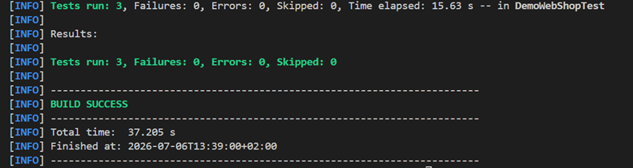
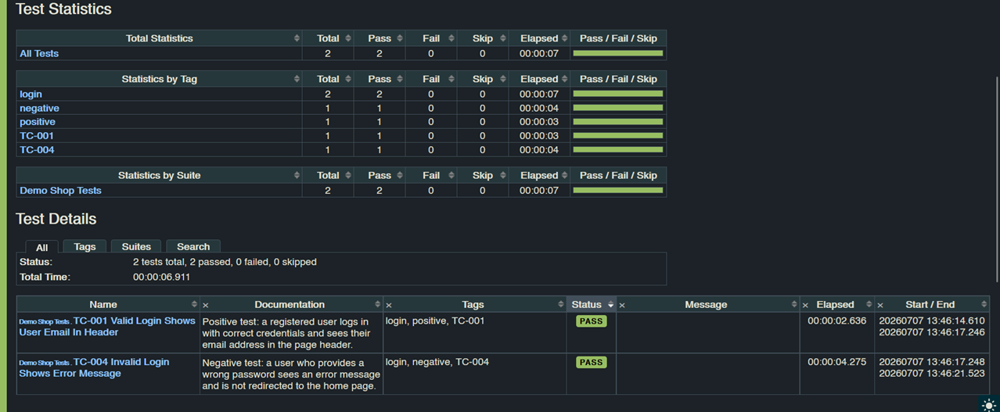
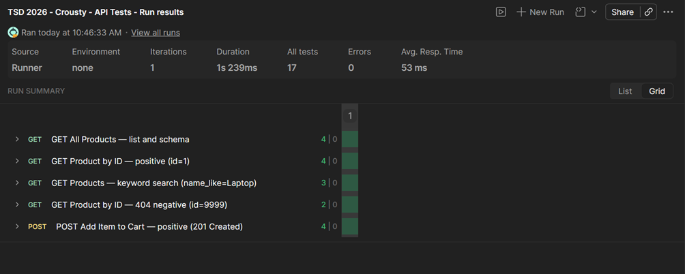

<!-- _class: title -->

# TSD 2026 — Software Testing Project

## Team Crousty

**Application:** Demo Web Shop · `https://tsd-2026-crousty.onrender.com`

**Submission:** 9 July 2026

<!--
SPEAKER 1 — Slides 1 to 4 (approximately 3 min 30)

Hello everyone. I'm [name] and I represent Team Crousty. Today we will present our software testing project carried out as part of the TSD 2026 course. The application we tested is called Demo Web Shop — a single-page online shop that we put through a comprehensive test suite, from manual test cases all the way to UI and REST API automation. The presentation is structured in three parts: first the project context and manual tests, then the automation tools, and finally the results summary and lessons learned.
-->

---

# 1. Application Overview

**Demo Web Shop** — a single-page e-commerce application

| Detail | Value |
|---|---|
| Stack | Node.js · json-server 0.17.4 · Vanilla JS |
| Routing | Hash-based SPA (`/#/login`, `/#/cart`, …) |
| URL | `https://tsd-2026-crousty.onrender.com` |

### Main features tested

- **User Authentication** — login / error handling
- **Product Search** — keyword search, results display
- **Shopping Cart** — add to cart, quantity, notifications
- **Checkout Process** — guest and registered flows
- **Boundary validation** — qty limits, password length

<!--
Demo Web Shop is a single-page e-commerce application built with Node.js and json-server. It offers the standard features of an online store: email and password authentication, keyword product search, a shopping cart with success notifications, and a complete checkout flow. The application is deployed live at tsd-2026-crousty.onrender.com and uses hash-based routing. The backend is a JSON file served by json-server, which also exposed a REST API that we tested directly with Postman, independently of the browser UI.
-->

---

# 2. Test Strategy

```
                  10 Manual Test Cases (TC-001 → TC-010)
                        ↓           ↓           ↓
              Selenium (3)    Robot FW (2)   Postman (API)
              TC-001/002/003  TC-001/004     REST endpoints
```

| Tool | Language | TC covered |
|---|---|---|
| JUnit 5 | Java | Rating unit tests (Lab 2) |
| Selenium WebDriver 4.18.1 | Java | TC-001, TC-002, TC-003 |
| Robot Framework 7.1.1 | Python | TC-001, TC-004 |
| Postman | — | REST API layer |

**Automation criteria:** stable UI flow · clear assertion · high regression value

<!--
Our test strategy follows a layered approach. At the base, ten manual test cases define the complete functional coverage of the application. These scenarios are then automated using three complementary tools: Selenium WebDriver in Java for high-value UI regression tests, Robot Framework in Python for a keyword-driven syntax accessible to non-developers, and Postman to validate the REST API layer without going through the browser. In parallel, JUnit 5 was used for a standalone unit testing exercise on a Rating class. Our automation criteria are based on three conditions: the flow must be stable, the assertion must be clear, and the regression value must be high.
-->

---

# 3. Manual Test Cases

| TC ID | Title | Type | Status |
|---|---|---|---|
| TC-001 | Successful login | Positive | ✅ PASS |
| TC-002 | Search existing product | Positive | ✅ PASS |
| TC-003 | Add item to cart | Positive | ✅ PASS |
| TC-004 | Login with wrong password | Negative | ✅ PASS |
| TC-005 | Search non-existing product | Negative | ✅ PASS |
| TC-006 | Checkout with empty cart | Negative | ✅ PASS |
| TC-007 | Password minimum length | Boundary | ✅ PASS |
| TC-008 | Add zero/negative quantity | Boundary | ❌ BUG-001 |
| TC-009 | Full checkout – Guest | Flow | ✅ PASS |
| TC-010 | Full checkout – Registered | Flow | ✅ PASS |

**9/10 PASS · 1 defective (BUG-001)**

<!--
The manual test suite covers positive, negative, boundary, and full-flow scenarios. Nine tests pass, and the only failing case is TC-008, which checks that the cart rejects zero or negative quantity values. This result is important because it shows that the application still lacks a validation rule for a very small but meaningful boundary condition.
-->

---

# 4. Defect Report — BUG-001

**Title:** System accepts quantity 0 silently — no validation error

| Field | Value |
|---|---|
| **Severity** | Medium |
| **Component** | Shopping Cart |
| **Steps** | Open product page → enter qty `0` → click Add to cart |
| **Expected** | Error: "Quantity must be greater than 0" |
| **Actual** | ✅ Success toast shown, but cart count stays at 0 |
| **Status** | Fixed |

> Silent success with incorrect data is **harder to detect** than a crash and
> more confusing for end users — the cart appears to have accepted the item.

<!--
SPEAKER 2 — Slides 5 to 8 (approximately 3 min 30)

BUG-001 is the main defect identified during boundary testing. The scenario is straightforward: the user enters quantity zero on a product page and clicks Add to cart. The application displays a green success toast — exactly as if the addition had worked — but the cart counter stays at zero. This silent behavior is particularly problematic: the user believes they added an item, navigates to the cart, and finds nothing. The expected fix is an explicit validation error stating the quantity must be greater than zero. Without boundary test TC-008, this defect would have gone completely unnoticed, since the nominal flow alone is not enough to trigger it.
-->

---

# 5. Selenium WebDriver Automation

**Tool:** Selenium 4.18.1 + JUnit 5 · Java  

| Test | TC | Result |
|---|---|---|
| `TC001_shouldLoginWithValidCredentials` | TC-001 | ✅ PASS |
| `TC002_shouldDisplayResultsForLaptop` | TC-002 | ✅ PASS |
| `TC003_shouldAddProductToCart` | TC-003 | ✅ PASS |



<!--
Using Selenium WebDriver 4.18.1 and JUnit 5 in Java, we automated the three test cases with the highest regression value. TC-001 checks valid login by verifying the user's email appears in the header. TC-002 verifies search by ensuring results are displayed for the keyword Laptop. TC-003 validates adding to cart by waiting for the confirmation toast and the increment of the cart badge. All tests pass in BUILD SUCCESS in under 16 seconds. Key decisions: Selenium Manager 4 handles ChromeDriver automatically with no manual installation, WebDriverWait replaces all sleep() calls to handle async interactions, and localStorage.clear() in @BeforeEach guarantees test isolation.
-->

---

# 6. Robot Framework Automation

**Tool:** Robot Framework 7.1.1 + SeleniumLibrary 6.7.1 · Python  

| Test | TC | Type | Result |
|---|---|---|---|
| TC-001 Valid Login Shows User Email In Header | TC-001 | Positive | ✅ PASS |
| TC-004 Invalid Login Shows Error Message | TC-004 | Negative | ✅ PASS |

**Keywords:** `Open Demo Web Shop` · `Navigate To Login Page` · `Fill Login Form` · `Verify User Is Logged In` · `Verify Login Error Message`



<!--
Robot Framework offers a complementary approach to Selenium through keyword-driven syntax. Rather than writing imperative code, tests are described in near-natural language: Open Demo Web Shop, Navigate To Login Page, Fill Login Form, Verify User Is Logged In. This readability is valuable because tests can be understood by all team members, developers and non-developers alike. We covered TC-001 as a positive scenario and TC-004 — the incorrect-password login — as a negative one. Both tests pass in under 7 seconds. The keyword-driven approach also simplifies maintenance: a CSS selector change only needs to happen once inside the keyword, and every test using it benefits automatically.
-->

---

# 7. Postman API Tests

**Collection:** TSD 2026 - Crousty - API Tests · `{{BASE_URL}}` = `https://tsd-2026-crousty.onrender.com`

| # | Request | Type | Expected | Result |
|---|---|---|---|---|
| 1 | `GET /products` | Positive | 200, array non-empty, schema | ✅ PASS |
| 2 | `GET /products/1` | Positive | 200, id=1, price > 0 | ✅ PASS |
| 3 | `GET /products?name_like=Laptop` | Positive | 200, results contain keyword | ✅ PASS |
| 4 | `GET /products/9999` | Negative | 404 | ✅ PASS |
| 5 | `POST /cart` | Positive | 201, productId + quantity | ✅ PASS |

**5 requests · 17 assertions · 5 PASS · 0 FAIL**



<!--
For API testing, Postman validates the HTTP layer directly, without going through the browser. Our collection contains 5 requests in two folders. On the Products side: list all products, retrieve a product by ID with schema validation, search by keyword using json-server's name_like filter, and verify that a non-existing ID returns 404. On the Cart side: create an item via POST and verify the response contains the auto-generated id, the productId, and the expected quantity with status 201. In total, 17 assertions cover HTTP status codes, JSON structure, and data validity. All 5 tests pass.
-->

---

# 8. Results Summary

| Lab | Tool | Tests | ✅ Pass | ❌ Fail |
|---|---|---|---|---|
| Lab 3 | Manual (Demo Web Shop) | 10 | 9 | 1 |
| Lab 4 | Selenium WebDriver | 3 | 3 | 0 |
| Lab 5 | Robot Framework | 2 | 2 | 0 |
| Lab 6 | Postman | 5 | 5 | 0 |

> Lab 2 (JUnit — Rating class) is a standalone exercise, not a Demo Web Shop test.

**Total automated:** 10 tests · 10 passed · 0 failed · 1 defect fixed (BUG-001)


<!--
SPEAKER 3 — Slides 9 to 11 (approximately 3 min 20)

In summary, here are the project numbers. Manual phase: 10 tests, 9 pass, 1 defect found and fixed. Automated UI layer: 5 tests pass — 3 Selenium and 2 Robot Framework — with zero failures. API layer: all 5 Postman requests pass with 17 assertions validated. In total, 10 automated tests are reproducible and executable without human intervention. The JUnit exercise from Lab 2 achieves 100% line coverage as a standalone unit testing exercise. The coverage chart on this slide illustrates the strength of that unit test suite.
-->

---

# 9. Lessons Learned

1. **Synchronization matters for SPAs.** Use explicit waits instead of fixed delays.

2. **Isolation is part of test design.** Clear shared state before each run.

3. **Choose the right tool for the level.** Selenium, Robot Framework, and Postman each have a role.

4. **Boundary tests find defects.** BUG-001 came from the quantity-0 case.

5. **Portability improves reproducibility.** Maven Wrapper simplifies setup across machines.

6. **A green test is not always a correct product.** BUG-001 showed that clearly.

<!--
Several important lessons emerged from this project. First: synchronization is a core concept for modern web apps, because asynchronous interfaces require explicit waiting strategies rather than fixed delays. WebDriverWait and Wait Until Element Is Visible were the practical application of that principle. Second: isolation is part of test design, not an afterthought — localStorage.clear() prevented browser state from leaking between cases and helped preserve repeatability. Third: tool choice should match the testing level, because no single tool covers everything well: Selenium for browser interaction, Robot Framework for readable acceptance tests, and Postman for API contract validation. Fourth: boundary value analysis is often where defects appear — the quantity-zero case is a perfect example. Fifth: portability matters when sharing environments, and the Maven Wrapper reduces setup friction. Final point: a test can pass while the product is still wrong, so expected business rules must be checked explicitly.
-->

---

<!-- _class: title -->

# Conclusion

The Demo Web Shop project exercised the **full testing lifecycle**:

manual design → unit testing → UI automation → API testing

**9/10 manual tests pass · 1 confirmed defect · 10 automated tests green**

Each tool has its place: JUnit for logic, Selenium for Java-team automation,
Robot Framework for readable acceptance tests, Postman for API contracts.

<!--
To conclude, this project took us through the entire software testing lifecycle: from manual test design to multi-layer UI automation and API testing. The Demo Web Shop proved an ideal environment — realistic enough to expose genuine technical challenges such as async DOM handling, SPA routing, and state management, yet fully controllable. The combination of four tools — JUnit, Selenium, Robot Framework, Postman — illustrates that there is no universal testing tool: each layer of the application deserves its own tool suited to its level of abstraction. Thank you for your attention. We are happy to answer any questions.
-->
